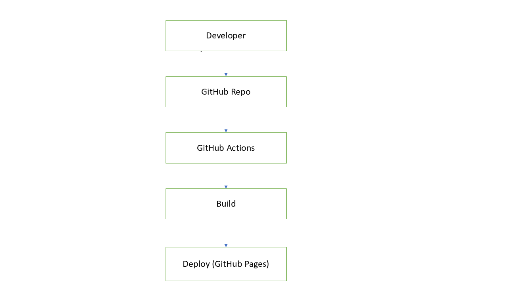
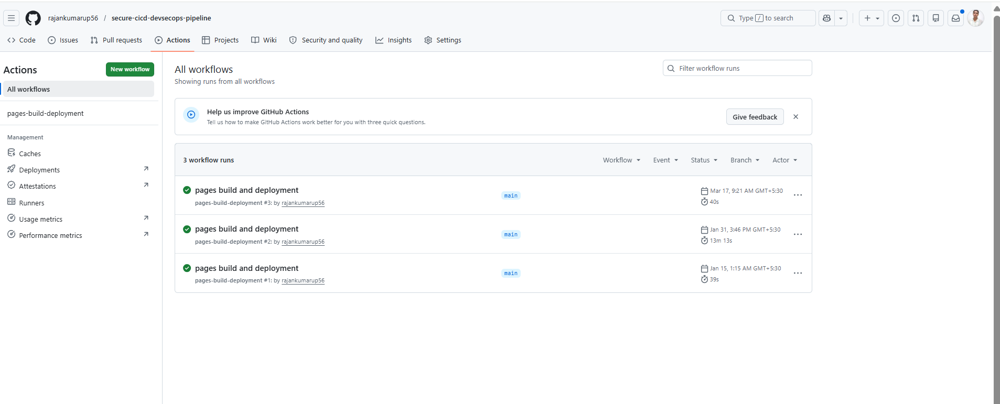
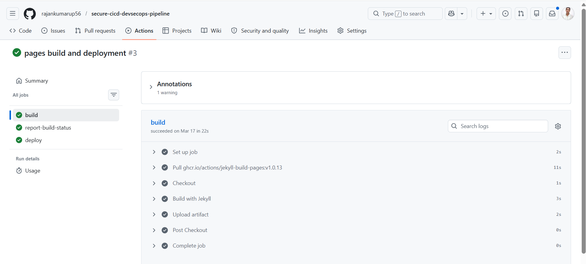
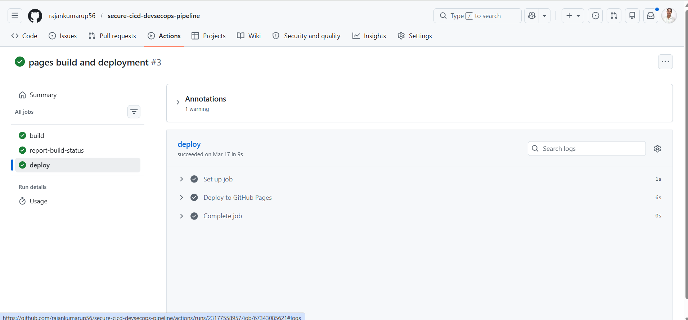

# 🚀 Secure CI/CD DevSecOps Pipeline

## 📌 Overview

This project demonstrates a complete CI/CD pipeline with integrated DevSecOps practices using GitHub Actions. It automates the build and deployment process while ensuring security and efficiency.

---

## 🏗️ Architecture



---

## ⚙️ Workflow

1. Developer pushes code to GitHub
2. GitHub Actions triggers automatically
3. Build process starts
4. Deployment to GitHub Pages
5. Continuous integration & delivery ensured

---

## 📸 Project Screenshots

### 🔹 Repository Overview


---

### 🔹 CI/CD Pipeline Overview



---

### 🔹 Pipeline Execution (Success)


---

### 🔹 Pipeline Build Stage



---

### 🔹 Pipeline Deploy Stage



---

## 🚀 Key Features

* Automated CI/CD using GitHub Actions
* Continuous deployment with GitHub Pages
* Scalable and reusable pipeline
* Real-time build and deployment tracking
* DevSecOps-ready workflow

---

## 🛠️ Tech Stack

* GitHub Actions
* GitHub Pages
* YAML (Workflow Configuration)
* CI/CD Concepts

---

## 📂 Project Structure

```
.
├── .github/workflows/
├── architecture-diagram.png
├── repo-overview.png
├── pipeline-overview.png
├── pipeline-run-success.png
├── pipeline-build.png
├── pipeline-deploy.png
└── README.md
```

---

## 🎯 Conclusion

This project demonstrates a fully automated CI/CD pipeline with deployment capabilities. It highlights practical implementation of DevOps and DevSecOps principles using GitHub Actions.

---

## 👨‍💻 Author

**Ranjan Kumar Upadhyay**
